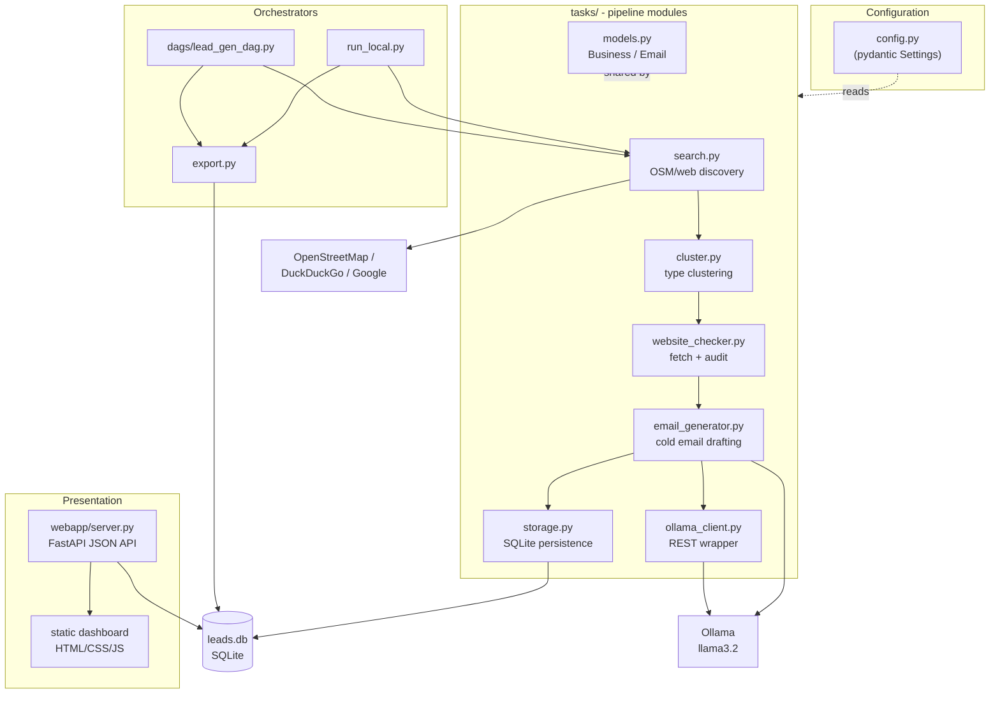

# Architecture

LEADFIELD is a modular pipeline. Each stage is a standalone, importable module
in `tasks/` with explicit inputs and outputs. Two thin orchestrators drive the
same functions: the local CLI (`run_local.py`) and the Airflow DAG
(`dags/lead_gen_dag.py`). A read-only FastAPI app (`webapp/`) renders the
results.

## Component map

## Design principles

- **Pure, importable stages.** Every `tasks/` module exposes functions that take
  inputs and return outputs, with an optional `settings` argument. No module
  reads global mutable state. This is what lets the CLI and the DAG share code.
- **One model that flows through the pipeline.** A single `Business` Pydantic
  model is enriched at each stage (`cluster` adds `category`, `website_checker`
  adds the site fields). It is JSON serializable, so it crosses Airflow XCom
  boundaries via `model_dump()` / `model_validate()`.
- **Graceful degradation.** Search failures return empty lists, dead websites
  are marked rather than raised, and an unreachable Ollama falls back to a
  deterministic template so the pipeline always completes.
- **Configuration at the edges.** All tunables live in `config.py` as a typed
  `Settings` object, overridable by environment variables.

## Module responsibilities

| Module | Input | Output | Notes |
|--------|-------|--------|-------|
| `search.py` | category + location | `list[Business]` | throttled, deduped by domain |
| `cluster.py` | `list[Business]` | `list[Business]` | keyword scoring into 9 clusters |
| `website_checker.py` | `list[Business]` | `list[Business]` | directory detection + heuristic audit |
| `email_generator.py` | `list[Business]` | `list[Email]` | improve vs build prompt selection |
| `ollama_client.py` | prompt | text / stream | retries, streaming, model fallback |
| `storage.py` | models | row counts | idempotent upserts |
| `export.py` | (reads DB) | CSV rows | incremental, tracked by `exported_at` |

See also: [pipeline.md](pipeline.md) for the runtime flow, and
[data-model.md](data-model.md) for the database schema.
