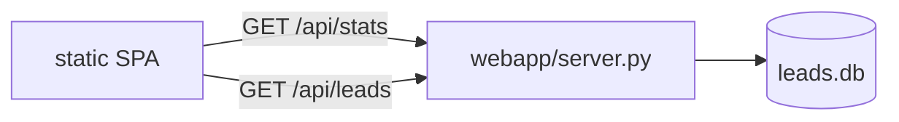

# Dashboard

A read-only web dashboard renders the generated leads as a scrolling "field
report". It is a FastAPI app serving a small JSON API plus a static
single-page UI with scroll-driven animations.

```bash
make ui            # http://localhost:8000
# or:
python -m uvicorn webapp.server:app --reload --port 8000
```

The dashboard reads the same `data/leads.db`. If the database does not exist
yet, the API returns empty payloads and the UI shows an elegant empty state, so
you can open it before the first pipeline run.

## Sections (top to bottom)

1. **Hero** - editorial headline over a radar/grain atmosphere.
2. **The scan** - count-up stat band (businesses, sites audited, gaps, emails).
3. **The gap** - an animated split bar of "has website" vs "no website".
4. **Signal** - animated horizontal bars per business category.
5. **The dossier** - filterable, searchable grid of lead cards. Click a card to
   open a detail panel with the full drafted email, site observations, and a
   copy-to-clipboard button.

## API



| Endpoint | Returns |
|----------|---------|
| `GET /api/stats` | totals, location, per-category counts, models used |
| `GET /api/leads` | every email joined with its business context + observations |
| `GET /` | the dashboard shell |
| `GET /api/docs` | FastAPI interactive docs |

## Design notes

- **Type:** Fraunces (display serif), Hanken Grotesk (body), IBM Plex Mono
  (data/labels).
- **Palette:** deep ink canvas, warm amber primary signal, ember for
  no-website opportunities, mint for existing sites.
- **Motion:** scroll progress bar, `IntersectionObserver` reveals with stagger,
  requestAnimationFrame count-ups, animated bar widths, a sliding detail panel.
  All motion is disabled under `prefers-reduced-motion`.

The frontend is dependency-free (no build step): `webapp/static/index.html`,
`styles.css`, and `app.js`.
