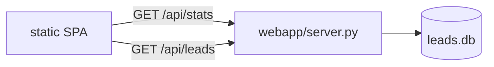
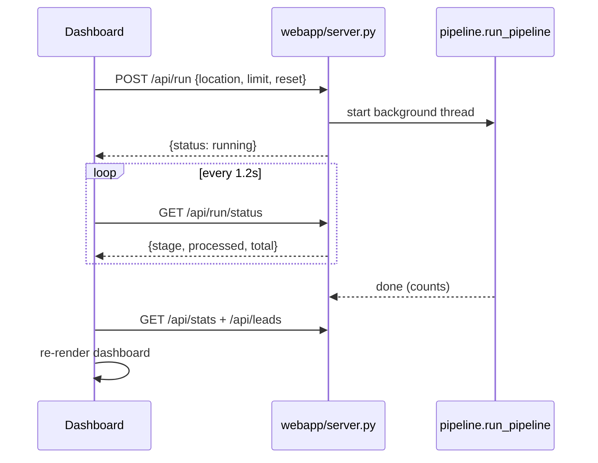

# Dashboard

A read-only web dashboard renders the generated leads as a scrolling "field
report". It is a FastAPI app serving a small JSON API plus a static
single-page UI with scroll-driven animations.

```bash
make ui            # http://localhost:8000
# or:
python -m uvicorn webapp.server:app --reload --port 8000
```

The dashboard reads the same `data/leads.db`. If the database does not exist
yet, the API returns empty payloads and the UI shows an elegant empty state, so
you can open it before the first pipeline run.

## Sections (top to bottom)

1. **Hero** - editorial headline over a radar/grain atmosphere.
2. **The scan** - count-up stat band (businesses, sites audited, gaps, emails).
3. **The gap** - an animated split bar of "has website" vs "no website".
4. **Signal** - animated horizontal bars per business category.
5. **The dossier** - filterable, searchable grid of lead cards. Click a card to
   open a detail panel with the full drafted email, site observations, and a
   copy-to-clipboard button.

## API



| Endpoint | Returns |
|----------|---------|
| `GET /api/stats` | totals, location, per-category counts, models used |
| `GET /api/leads` | every email joined with its business context + observations |
| `POST /api/run` | start a pipeline run across one or more locations (background job) |
| `GET /api/run/status` | poll the current run's stage/progress |
| `POST /api/schedules` | create a one-time or daily scheduled scan |
| `GET /api/schedules` | list scheduled scans |
| `DELETE /api/schedules/{id}` | delete a schedule |
| `GET /api/analytics` | aggregated metrics for the analytics charts |
| `GET /` | the dashboard shell |
| `GET /api/docs` | FastAPI interactive docs |

## Scheduler tab

The nav has a **Scheduler** tab that opens a full-screen control room:

- **Cities / locations** - add any number of cities; a multi-city scan sweeps
  them sequentially (`POST /api/run` with a `locations` array).
- **Max businesses per city** - a free number input (1 to 1000), not capped at 40.
- **When** - `Run now`, `Once at` a datetime, or `Daily at` a time of day.
- **Scheduled scans** - lists pending/done schedules with their cities, cap, and
  last-run time; each can be deleted.

Schedules persist in the `schedules` SQLite table. A background thread in
`webapp/server.py` ticks every 30s, fires any due schedule, and survives server
restarts. A schedule's status reflects the real run lifecycle:
`pending -> running -> done` (with a "N leads across M location(s)" summary),
flipping to `done` only when the scan actually completes.

While the Scheduler tab is open it polls `/api/run/status` every 2s and shows a
live **scan in progress** banner (current city, stage, and progress) for any
active run, whether started here or fired by a schedule.

## Dashboard tab (analytics)

The **Dashboard** nav tab opens an analytics view backed by `/api/analytics`,
with KPI tiles and animated, dependency-free SVG/CSS charts:

- **Website gap** donut (has-site vs no-site).
- **Leads by category** stacked bars (mint = has site, ember = no site).
- **Leads by city** bars (useful after multi-city scans).
- **Top website issues** bars, derived from the audit observations
  (missing SEO description, not mobile-friendly, thin content, ...).

The whole dashboard also auto-refreshes when any run finishes: a watcher polls
`/api/run/status` every 6s, shows "scanning…" in the nav during a run, and
re-fetches stats/leads the moment it completes (so scheduled runs appear without
a manual reload).

## Live scan from the UI

The hero includes a control deck: enter a location, pick a max-leads cap, and
press **Run live scan**. The dashboard `POST`s to `/api/run`, which launches the
pipeline in a background thread, then polls `/api/run/status` every ~1.2s to show
the live stage (`search -> audit -> draft -> done`) and a progress bar. On
completion it refetches `/api/stats` and `/api/leads` and re-renders everything
in place, with no page reload.



A run with `reset: true` clears prior results first, so switching location gives
a clean dossier for the new city.

## Design notes

- **Type:** Fraunces (display serif), Hanken Grotesk (body), IBM Plex Mono
  (data/labels).
- **Palette:** deep ink canvas, warm amber primary signal, ember for
  no-website opportunities, mint for existing sites.
- **Motion:** scroll progress bar, `IntersectionObserver` reveals with stagger,
  requestAnimationFrame count-ups, animated bar widths, a sliding detail panel.
  All motion is disabled under `prefers-reduced-motion`.

The frontend is dependency-free (no build step): `webapp/static/index.html`,
`styles.css`, and `app.js`.
