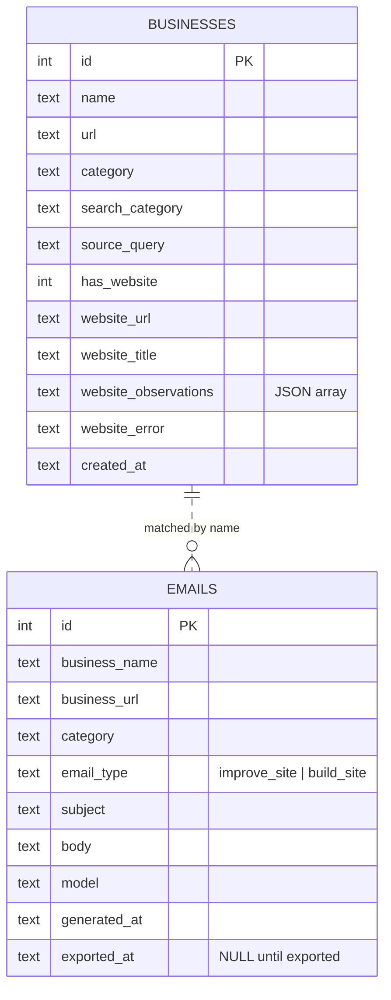

# Data model

Results are stored in a SQLite database (`data/leads.db` by default,
overridable with `LEADGEN_DATABASE_PATH`). Two tables: `businesses` and
`emails`. The CSV export adds an `exported_at` column to `emails` to track
incremental exports.

## Schema



> The link between tables is by `business_name` (and url), not a hard foreign
> key. The web API and the CSV export resolve `website_url` / `has_website` from
> `businesses` via a correlated subquery on the name, so duplicate business rows
> can never multiply email rows.

## Pydantic models

The in-memory representations live in `tasks/models.py`:

- **`Business`** - enriched through the pipeline. Identity fields are set by
  `search`, `category` by `cluster`, and the `website_*` fields by
  `website_checker`.
- **`Email`** - the generated cold email, with `email_type` of `improve_site`
  or `build_site`.

Both are JSON serializable so they cross Airflow XCom boundaries.

## Idempotency

- `businesses` has a `UNIQUE(name, url)` constraint; saves use
  `INSERT OR REPLACE`, so re-running the pipeline refreshes rather than
  duplicates.
- `emails` has a `UNIQUE(business_name, business_url)` constraint with the same
  upsert behavior.
- `export.py` only writes rows where `exported_at IS NULL`, then stamps them, so
  the CSV grows incrementally without duplicates.

## Inspecting the database

```bash
make db-shell          # opens sqlite3 on data/leads.db
make emails            # prints business_name, email_type, subject

sqlite3 data/leads.db "SELECT category, COUNT(*) FROM businesses GROUP BY category;"
```
