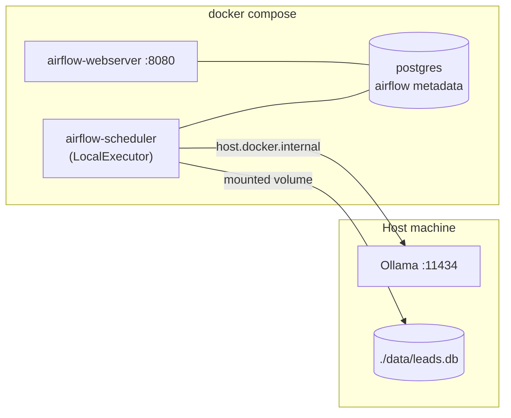
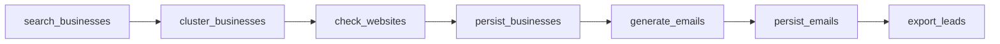

# Deployment & running

There are two ways to run the pipeline: a local CLI for fast iteration, and
Apache Airflow via Docker Compose for orchestration. Both share the same task
code and write to the same SQLite database.

## Prerequisites

- Python 3.11+
- [Ollama](https://ollama.com) installed and running
- Docker + Docker Compose (only for the Airflow path)

## Install Ollama and a model

```bash
brew install ollama        # see ollama.com for non-macOS
ollama serve               # leave running in its own terminal
ollama pull llama3.2       # primary model
ollama pull llama3.1       # optional fallback
curl http://localhost:11434/api/tags   # verify
```

`make ollama-pull` pulls the model named by `OLLAMA_MODEL` (default `llama3.2`).

## Local CLI

```bash
make setup        # venv + runtime + dev deps
make healthcheck  # verify python, ollama, models, db
make run          # full pipeline -> data/leads.db
```

Flags via `run_local.py` directly:

```bash
python run_local.py --location "Denver, CO" --categories restaurants gyms
python run_local.py --limit 5            # cap businesses processed
python run_local.py --skip-ollama-check  # use templated fallback emails
```

## Airflow (Docker Compose)

Ollama runs on the host; the containers reach it at
`host.docker.internal:11434` (already configured).



```bash
make docker-up     # writes AIRFLOW_UID, starts the stack
# open http://localhost:8080  (airflow / airflow)
# enable + trigger the lead_gen_pipeline DAG, or:
make trigger
make docker-logs   # tail scheduler/webserver
make docker-down   # stop (keep data)
make docker-reset  # stop + wipe metadata volume
```

The DAG runs each stage as a separate task and passes data through XCom as
plain dicts:



## Configuration

All settings live in `config.py` and are overridable via environment variables
(prefix `LEADGEN_`, except `OLLAMA_BASE_URL`). Copy `.env.example` to `.env`.

| Variable | Default | Meaning |
|----------|---------|---------|
| `LEADGEN_LOCATION` | `Boston, MA` | location appended to queries |
| `LEADGEN_SEARCH_BACKEND` | `duckduckgo` | `duckduckgo` (keyless) or `google` |
| `LEADGEN_RESULTS_PER_CATEGORY` | `10` | search results per category |
| `LEADGEN_SEARCH_DELAY_SECONDS` | `2.5` | delay between queries |
| `OLLAMA_BASE_URL` | `http://localhost:11434` | Ollama API base |
| `LEADGEN_OLLAMA_MODEL` | `llama3.2` | primary model |
| `LEADGEN_OLLAMA_FALLBACK_MODEL` | `llama3.1` | fallback model |
| `LEADGEN_DATABASE_PATH` | `data/leads.db` | SQLite path |
| `LEADGEN_SENDER_NAME` / `_COMPANY` / `_EMAIL` | - | sender identity in emails |

## Troubleshooting

- **Google rate limiting:** increase `LEADGEN_SEARCH_DELAY_SECONDS`.
- **Ollama unreachable:** the pipeline still completes using a templated
  fallback email; run `make healthcheck` to confirm the server and models.
- **Airflow cannot import tasks:** the DAG inserts the project root on
  `sys.path`; ensure `./tasks`, `./config.py`, and `./export.py` are mounted
  (they are, in `docker-compose.yml`).
