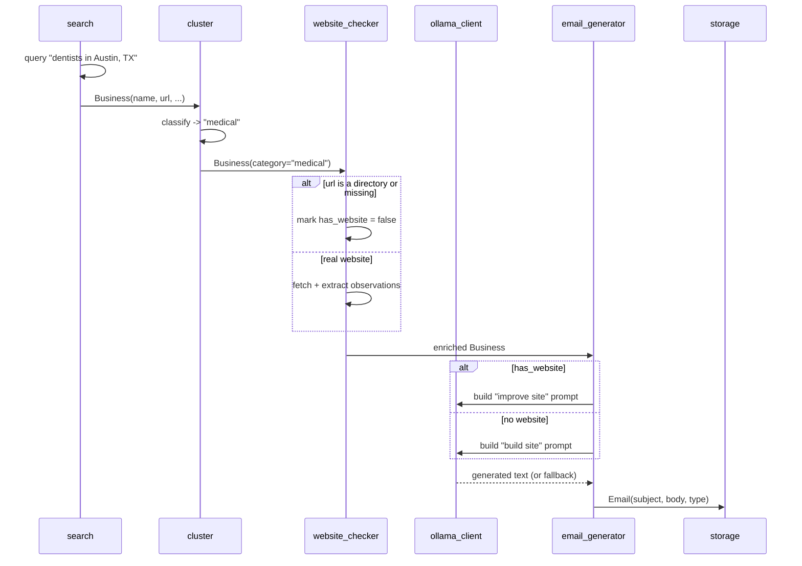
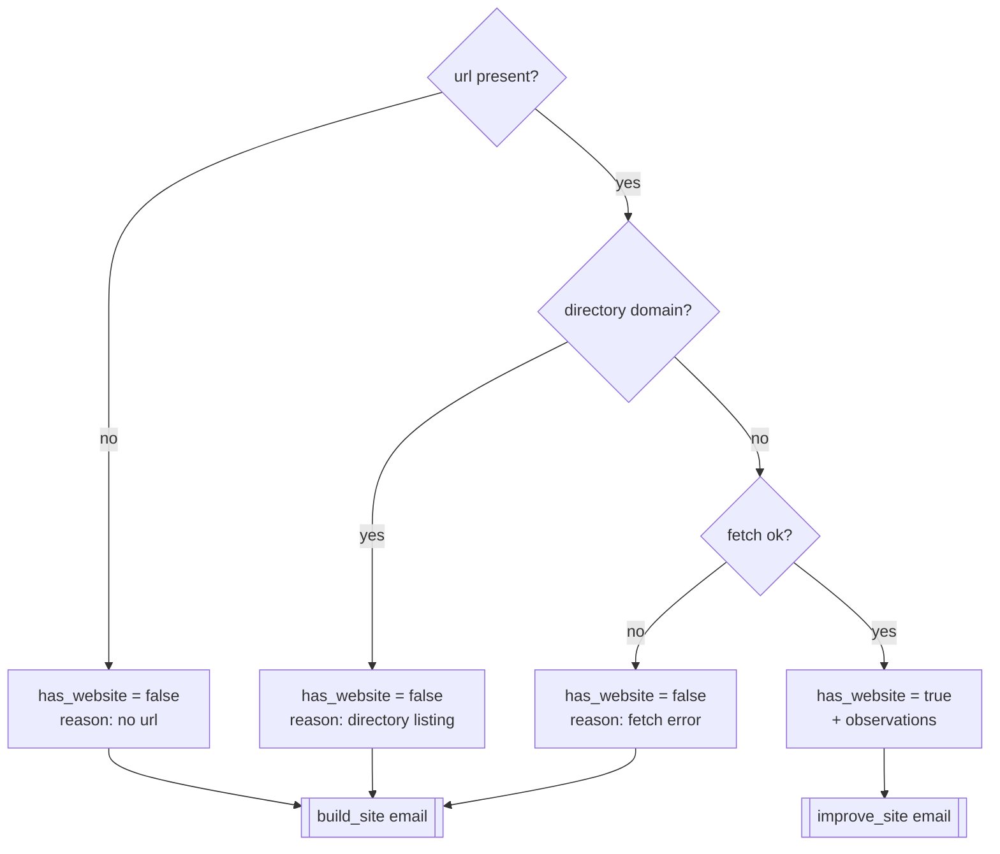

# Pipeline

The pipeline runs five stages in sequence, then exports. Data flows as a list of
`Business` models that get enriched stage by stage, fanning out into `Email`
models at the generation step.

## Stage flow

## Sequence (one business)

## Branching logic

The single most important branch is **website vs no website**, decided in
`website_checker.check_business`:

## Website audit heuristics

`website_checker._build_observations` produces up to four observations that the
LLM references in the email:

- no mobile viewport meta tag (likely not responsive)
- missing meta description (SEO)
- missing or empty `<title>` tag
- very thin content (word count under 150)
- table-based layout (outdated markup)
- no recent copyright year
- no images detected

## Search backends

`search.py` supports three discovery backends, selected by
`LEADGEN_SEARCH_BACKEND`:

| Backend | Source | Notes |
|---------|--------|-------|
| `overpass` (default) | OpenStreetMap via Overpass | Real business entities; many have no `website` tag, which become "build a site" leads. Geocodes the location with Nominatim, then queries OSM tags mapped from each category. |
| `duckduckgo` | DuckDuckGo HTML endpoint | Keyless web search; returns roundup/listicle pages as often as individual sites. |
| `google` | googlesearch-python | Often returns nothing now (Google serves a JavaScript-gated page to scrapers). |

All backends return the same `Business` shape, so the rest of the pipeline is
identical regardless of source.

## Clustering

`cluster.classify` scores each business against a keyword map and assigns the
highest-scoring of: `restaurant`, `retail`, `medical`, `legal`, `construction`,
`beauty`, `fitness`, `automotive`, `professional_services`, or `other`.

## Throttling and resilience

- A configurable delay (`LEADGEN_SEARCH_DELAY_SECONDS`, default 2.5s) is inserted
  between Google queries.
- `ollama_client` retries transient network and 5xx errors with exponential
  backoff (tenacity) and falls back from the primary to the secondary model.
- Every stage degrades gracefully; see [architecture.md](architecture.md).
